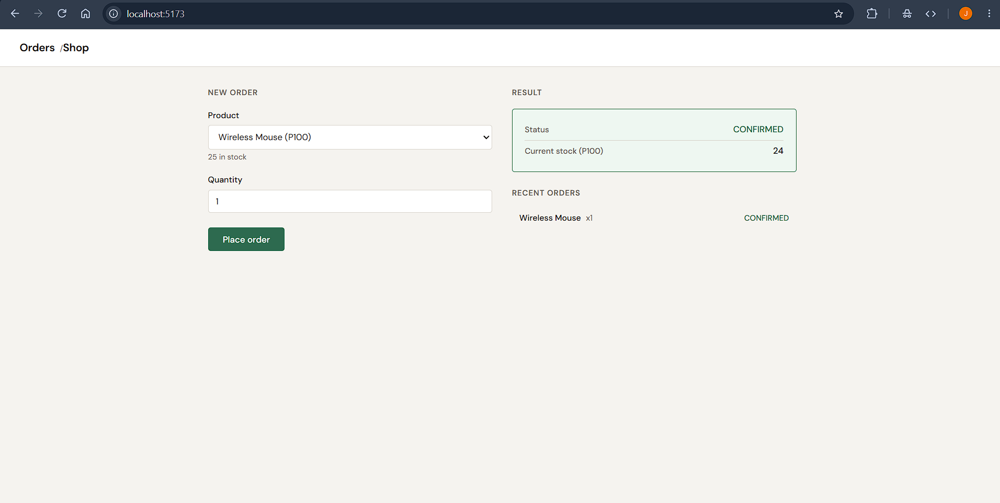
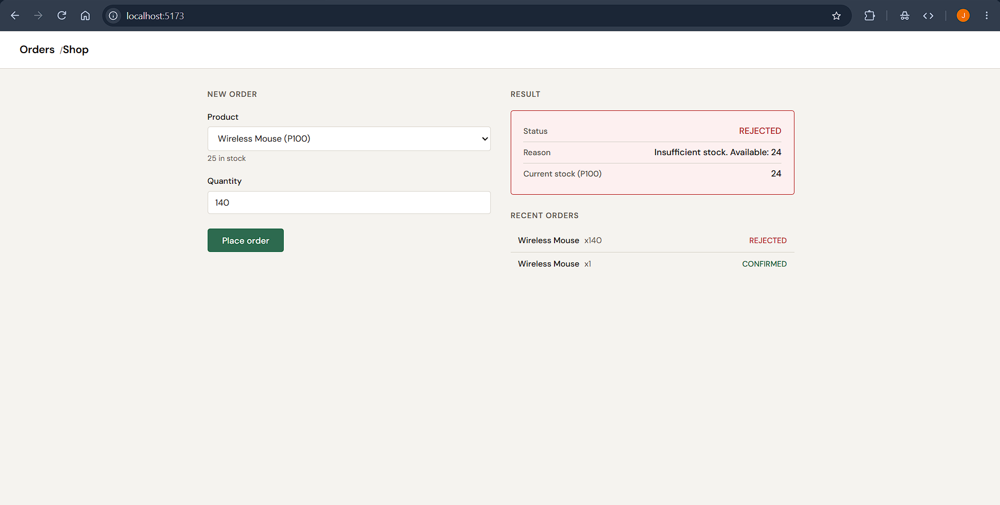

# IT342 Modular Monolith — Orders & Inventory

A Spring Boot modular monolith with two in-process modules (Order and Inventory) sharing one Supabase Postgres database, exposed over REST to a Vite React frontend.

## Stack

- Java 17 + Spring Boot 4.1.1 (Spring Data JPA)
- Vite 5 + React 18
- Supabase (PostgreSQL)

## Supabase Setup

1. Create a new project in Supabase (or use an existing one).
2. Open **SQL Editor** from the dashboard.
3. Paste and run the contents of `shop/src/main/resources/data.sql`:

```sql
CREATE TABLE IF NOT EXISTS inventory (
    product_id  VARCHAR(10) PRIMARY KEY,
    name        VARCHAR(100) NOT NULL,
    stock       INTEGER NOT NULL DEFAULT 0
);

CREATE TABLE IF NOT EXISTS orders (
    order_id    BIGSERIAL PRIMARY KEY,
    product_id  VARCHAR(10) NOT NULL REFERENCES inventory(product_id),
    quantity    INTEGER NOT NULL,
    status      VARCHAR(20) NOT NULL,
    reason      VARCHAR(255),
    created_at  TIMESTAMPTZ NOT NULL DEFAULT now()
);

INSERT INTO inventory (product_id, name, stock) VALUES
    ('P100', 'Wireless Mouse',        25),
    ('P200', 'Mechanical Keyboard',   10),
    ('P300', 'USB-C Hub',              0)
ON CONFLICT (product_id) DO NOTHING;
```

4. Note your **Host** and **Port** from Settings > Database (the connection string uses the pooler endpoint).

## Environment Variables

The backend reads database credentials from environment variables. Set these before running:

```
DB_URL=jdbc:postgresql://<host>:<port>/postgres
DB_USERNAME=<your-db-username>
DB_PASSWORD=<your-db-password>
```

On Windows (PowerShell):

```powershell
$env:DB_URL="jdbc:postgresql://aws-0-ap-southeast-2.pooler.supabase.com:5432/postgres"
$env:DB_USERNAME="postgres.IT342"
$env:DB_PASSWORD="your-password-here"
```

Alternatively, create `shop/src/main/resources/application-local.properties` (already gitignored) with the same keys and run with `--spring.profiles.active=local`.

## Running the Backend

```bash
cd shop
./mvnw spring-boot:run
```

The server starts on `http://localhost:8080`.

## Running the Frontend

```bash
cd frontend
npm install
npm run dev
```

The dev server starts on `http://localhost:5173`.

## Network Tab Evidence

### Confirmed Order (2x Wireless Mouse, stock 25)

**Request:**
```
POST http://localhost:8080/api/orders
Body: { "productId": "P100", "quantity": 2 }
```

**Response:**
```json
{
  "status": "CONFIRMED",
  "reason": null,
  "inventory": {
    "productId": "P100",
    "name": "Wireless Mouse",
    "stock": 23
  }
}
```



### Rejected Order (5x USB-C Hub, stock 0)

**Request:**
```
POST http://localhost:8080/api/orders
Body: { "productId": "P300", "quantity": 5 }
```

**Response:**
```json
{
  "status": "REJECTED",
  "reason": "Insufficient stock. Available: 0",
  "inventory": {
    "productId": "P300",
    "name": "USB-C Hub",
    "stock": 0
  }
}
```



## Reflection

### In-process vs. microservice integration

When Order and Inventory run as modules inside a single JVM, cross-module calls are plain Java method calls. This comes with significant advantages for free: transactional consistency via a single `@Transactional` boundary, no serialization overhead, no network latency, no service discovery, no API versioning, and no need for circuit breakers or retry logic. A failure in Inventory is immediately visible to Order as a Java exception rather than an HTTP 500 that must be parsed and interpreted. Debugging a single call stack across both modules is straightforward with standard IDE tooling.

If these modules were split into separate microservices, all of that would need to be added back. The Order service would need an HTTP or gRPC client to reach Inventory. The `reserve` call would become a remote operation requiring timeout configuration, retry policies, and potentially a saga or compensating transaction pattern to handle partial failures. Data consistency would shift from ACID to eventual consistency, requiring message queues or outbox patterns. Observability tooling (distributed tracing, centralized logging) becomes essential rather than optional.

### Why package-private visibility matters

Making `InventoryServiceImpl` package-private enforces the architectural boundary at compile time. The Order module can only depend on the `InventoryService` interface, which means it cannot couple to implementation details like Spring annotations, repository injection, or specific persistence logic. If `InventoryServiceImpl` were made public, nothing technically prevents the Order module from importing and using it directly, bypassing the interface contract. Over time, this erodes the module boundary: changes to the inventory implementation would ripple into order code, and the ability to swap implementations (for testing, or eventually for a remote service) would be lost. The package-private modifier is a lightweight, zero-cost enforcement mechanism that keeps the dependency arrow pointing in the right direction.

### When to extract Inventory into its own microservice

Extraction makes sense when the inventory domain has its own scaling requirements (e.g., it handles far more read traffic than orders), when different teams need to own and deploy it independently, or when it needs a different technology stack (e.g., a high-throughput cache layer). In practice, the trigger is usually organizational: two teams stepping on each other's release cadence. To extract, the Order module's dependency on `InventoryService` would be replaced with an HTTP or gRPC client implementation of the same interface. The REST API already exposed by `InventoryController` can serve as the contract. The main code changes would be: (1) creating a client-side `InventoryService` adapter that calls the remote API, (2) adding resilience patterns (timeouts, retries, circuit breakers), (3) handling eventual consistency for stock levels, and (4) moving to per-service database schemas instead of a shared one.
