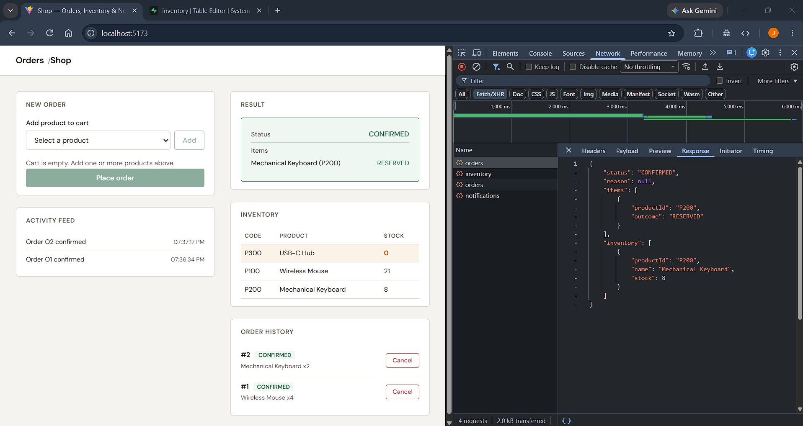
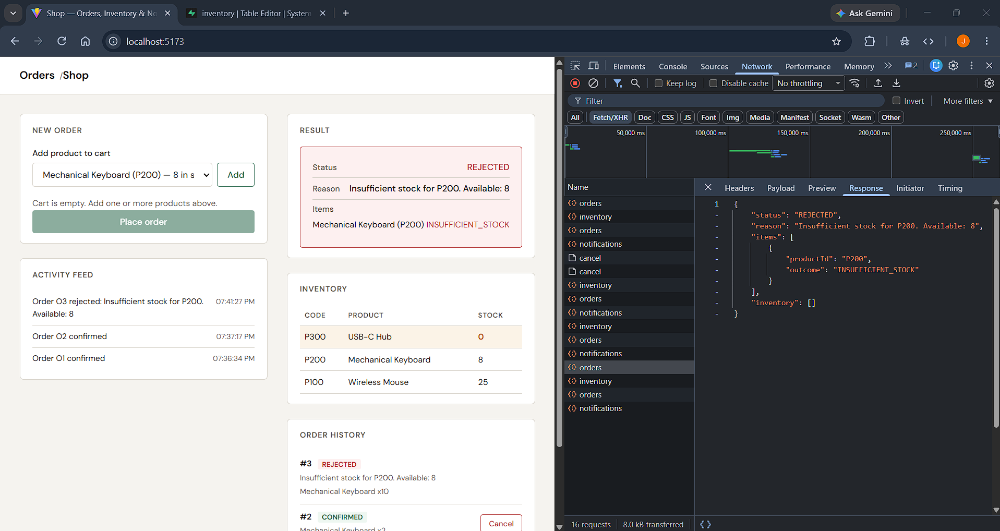
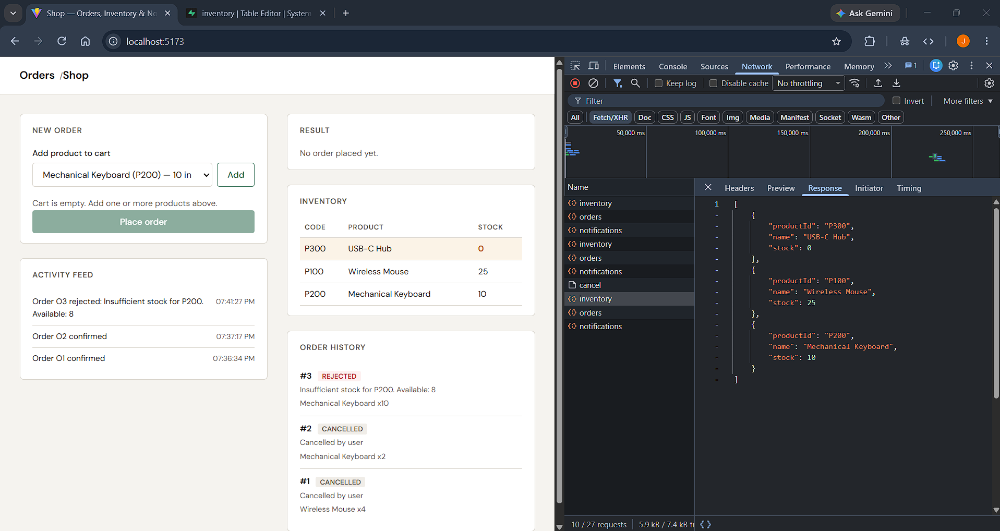
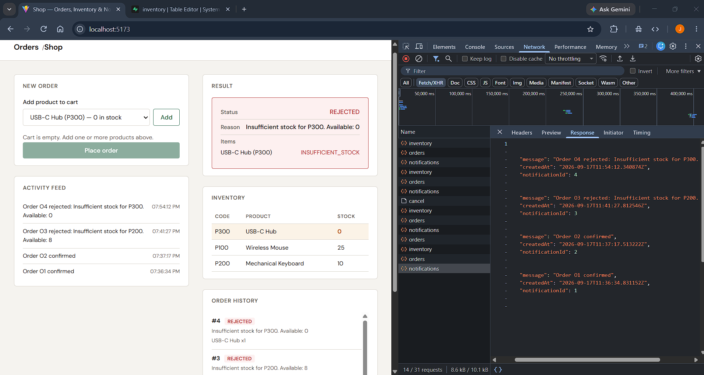

# IT342 Modular Monolith — Orders, Inventory & Notifications

A Spring Boot modular monolith with three in-process modules (Order, Inventory, and Notification) sharing one Supabase Postgres database, exposed over REST to a Vite React frontend.

## Stack

- Java 17 + Spring Boot 4.1.1 (Spring Data JPA)
- Vite 5 + React 18
- Supabase (PostgreSQL)

## Modules

| Module                        | Package                        | Responsibility                                            |
|-------------------------------|--------------------------------|-----------------------------------------------------------|
| Order (`shop`)                | `edu.cit.mayuela.shop`         | Multi-item orders, cancellation, domain events            |
| Inventory (`inventory`)       | `edu.cit.mayuela.inventory`    | Reserve / restock stock, live inventory queries           |
| Notification (`notification`) | `edu.cit.mayuela.notification` | Activity feed written from order & low-stock events       |

Event listeners run **synchronously** (no `@Async`): a notification is written to the `notifications` table in the same transaction as the order that triggered it. This makes the activity feed and the order result consistent within a single request/response cycle. It was deliberately left synchronous because this lab runs everything in one deployable; once Notification becomes its own service the listener would move behind an async broker (see Reflection).

## Supabase Setup

1. Create a new project in Supabase (or use an existing one).
2. Open **SQL Editor** from the dashboard.
3. Paste and run the contents of `shop/src/main/resources/data.sql`. The script drops and recreates the schema from scratch, including seed data:

```sql
DROP TABLE IF EXISTS order_items;
DROP TABLE IF EXISTS notifications;
DROP TABLE IF EXISTS orders;
DROP TABLE IF EXISTS inventory;

CREATE TABLE IF NOT EXISTS inventory (
    product_id  VARCHAR(10) PRIMARY KEY,
    name        VARCHAR(100) NOT NULL,
    stock       INTEGER NOT NULL DEFAULT 0
);

CREATE TABLE IF NOT EXISTS orders (
    order_id    BIGSERIAL PRIMARY KEY,
    status      VARCHAR(20) NOT NULL,
    reason      VARCHAR(255),
    created_at  TIMESTAMPTZ NOT NULL DEFAULT now()
);

CREATE TABLE IF NOT EXISTS order_items (
    id          BIGSERIAL PRIMARY KEY,
    order_id    BIGINT NOT NULL REFERENCES orders(order_id) ON DELETE CASCADE,
    product_id  VARCHAR(10) NOT NULL REFERENCES inventory(product_id),
    quantity    INTEGER NOT NULL
);

CREATE TABLE IF NOT EXISTS notifications (
    notification_id  BIGSERIAL PRIMARY KEY,
    message          VARCHAR(255) NOT NULL,
    created_at       TIMESTAMPTZ NOT NULL DEFAULT now()
);

INSERT INTO inventory (product_id, name, stock) VALUES
    ('P100', 'Wireless Mouse',        25),
    ('P200', 'Mechanical Keyboard',   10),
    ('P300', 'USB-C Hub',              0)
ON CONFLICT (product_id) DO NOTHING;
```

4. Note your **Host** and **Port** from Settings > Database (the connection string uses the pooler endpoint).

## Environment Variables

The backend reads database credentials from environment variables. Set these before running:

```
DB_URL=jdbc:postgresql://<host>:<port>/postgres
DB_USERNAME=<your-db-username>
DB_PASSWORD=<your-db-password>
```

On Windows (PowerShell):

```powershell
$env:DB_URL="jdbc:postgresql://aws-0-ap-southeast-2.pooler.supabase.com:5432/postgres"
$env:DB_USERNAME="postgres.IT342"
$env:DB_PASSWORD="your-password-here"
```

Alternatively, create `shop/src/main/resources/application-local.properties` (already gitignored) with the same keys and run with `--spring.profiles.active=local`.

## Running the Backend

```bash
cd shop
./mvnw spring-boot:run
```

The server starts on `http://localhost:8080`.

## Running the Frontend

```bash
cd frontend
npm install
npm run dev
```

The dev server starts on `http://localhost:5173` (allowed origin for CORS).

## API

| Method | Path                          | Description                                            |
|--------|-------------------------------|--------------------------------------------------------|
| GET    | `/api/inventory`              | All products with current stock                        |
| GET    | `/api/orders`                 | Order history with status, reason, and line items      |
| POST   | `/api/orders`                 | Place a multi-item order `{ items: [{productId, quantity}] }` |
| POST   | `/api/orders/{orderId}/cancel`| Cancel an order and restock its line items (404/409)   |
| GET    | `/api/notifications`          | Activity feed (confirmations, rejections, low stock)   |

### Multi-item ordering (all-or-nothing)

`POST /api/orders` validates **every** line item against current stock before reserving anything. If any single item exceeds available stock the entire order is `REJECTED` and no stock is touched. Only after all items pass does `OrderService` call `InventoryService.reserve()` for each item inside one transaction, so a failure mid-way rolls everything back.

Response shape: `{ status, reason, items: [{ productId, outcome }], inventory }`.

## Network Tab Evidence

Four scenarios were exercised from the browser and captured in the Network tab (screenshots below reference the DevTools request/response panels).

### 1. Multi-item order — all items succeed (CONFIRMED)

**Request `POST /api/orders`:**
```json
{ "items": [ { "productId": "P100", "quantity": 2 }, { "productId": "P200", "quantity": 3 } ] }
```

**Response:**
```json
{
  "status": "CONFIRMED",
  "reason": null,
  "items": [
    { "productId": "P100", "outcome": "RESERVED" },
    { "productId": "P200", "outcome": "RESERVED" }
  ],
  "inventory": [
    { "productId": "P100", "name": "Wireless Mouse", "stock": 18 },
    { "productId": "P200", "name": "Mechanical Keyboard", "stock": 7 }
  ]
}
```



### 2. Multi-item order — one item fails, whole order REJECTED

**Request `POST /api/orders`** (P300 has 0 stock, P100 has plenty):
```json
{ "items": [ { "productId": "P100", "quantity": 2 }, { "productId": "P300", "quantity": 5 } ] }
```

**Response:**
```json
{
  "status": "REJECTED",
  "reason": "Insufficient stock for P300. Available: 0",
  "items": [
    { "productId": "P100", "outcome": "RESERVED" },
    { "productId": "P300", "outcome": "INSUFFICIENT_STOCK" }
  ],
  "inventory": []
}
```

Nothing is reserved — a follow-up `GET /api/inventory` shows **P100 stock unchanged** (no partial fulfillment).



### 3. Cancel with restock

1. Place a confirmed multi-item order (P100 x2, P200 x3).
2. Note stock in `GET /api/inventory`: P100 18, P200 7.
3. **`POST /api/orders/{orderId}/cancel`** → `200 OK`.
4. `GET /api/inventory` afterward → **P100 back to 20, P200 back to 10** (quantities returned to stock). The order's status is now `CANCELLED`.



Cancelling an unknown order returns `404`; cancelling an already-cancelled order returns `409`.

### 4. Notification feed

`GET /api/notifications` shows the activity feed written by the domain-event listeners. After the flows above the feed should contain (newest last, or reversed per UI): a confirmation, a rejection, and a low-stock alert:

```json
[
  { "notificationId": 1, "message": "Order O1 confirmed", "createdAt": "..." },
  { "notificationId": 2, "message": "Order O2 rejected: Insufficient stock for P300. Available: 0", "createdAt": "..." },
  { "notificationId": 3, "message": "Reorder needed: P200 below threshold (4 remaining)", "createdAt": "..." }
]
```

The low-stock alert is a **distinct** entry (prefix `Reorder needed:`) and fires whenever a successful reserve drops a product below the threshold (`LOW_STOCK_THRESHOLD = 5`).



## Reflection

### What keeps multi-item orders atomic in-process?

A multi-item order touches `InventoryService` several times within one request. In the monolith, atomicity is guaranteed by a single database transaction: `OrderService.placeOrder` is `@Transactional`, and every `InventoryService.reserve()` call joins that same transaction (Spring's default `REQUIRED` propagation), so all reserve/insert operations share one DB connection. Because every line item is validated before the first `reserve()` is issued, the common rejection path never mutates stock at all. If a reserve still fails despite pre-validation (a concurrent request racing us), the exception propagates out of the transaction and Spring rolls back *everything* — earlier reserves included — leaving zero partial fulfillment. This is the classic all-or-nothing guarantee of ACID, and it costs us nothing because it's one JVM, one DB.

If Order and Inventory were split across a network this guarantee disappears: each `reserve()` becomes a remote call with its own connection and transaction, and a mid-order failure can leave earlier reservations stranded. I would need a saga (orchestrated: a coordinator issues Reserve steps then either confirms or compensates; choreographed: each step publishes events and compensating handlers undo prior steps). Compensating transactions would add a `release`/`restock` step to undo earlier reserves, plus idempotency keys so retries don't double-reserve, timeouts, retries, and distributed tracing. I'd also accept eventual consistency — the "validate everything first" step becomes a best-effort pre-check rather than an atomic guarantee, and true atomicity across services requires a distributed transaction protocol (2PC) that most teams deliberately avoid.

### How does event publishing decouple OrderService from Notification?

Instead of `orderService.callNotification.send(...)`, `OrderService` calls `applicationEventPublisher.publishEvent(...)` and never imports anything from the notification package. The dependency flows one way: Notification imports the event records (`OrderConfirmedEvent`, `OrderRejectedEvent`, `LowStockEvent`), and Order is completely unaware a listener exists. I can add a second listener, remove Notification, or reorder processing without touching Order. The coupling is now to the *event shape*, not to a *class*.

If Notification became a separate microservice, the in-process `ApplicationEventPublisher` + `@EventListener` pair would be replaced by a message broker (RabbitMQ or Kafka). I'd need: at-least-once delivery (with idempotent consumers or a dedup table) so a restarted consumer doesn't double-log, an outbox pattern on the Order side so the event is committed with the order and later published reliably, shared event schemas (with versioning so a schema change doesn't break the consumer), and an ordered stream (a partition key like `orderId`) if per-order ordering matters. The event records would move to a shared contracts artifact (or a schema registry), and Order would publish through the broker instead of directly to listeners.

### Which module would I extract first?

I would extract **Notification** first. It is a pure leaf: nothing depends on it, so pulling it out breaks no upstream callers; it only *consumes* domain events, which is exactly what a broker integration looks like; and it has its own table, so it can own its database. The code changes are small and mostly additive: move the three event records (plus `LowStockEvent`) into a shared contracts library, change `OrderService` to publish to a broker (e.g. via Spring Cloud Stream or an outbox publisher) instead of `ApplicationEventPublisher`, and redeploy the notification listener as a standalone Spring Boot app with `@KafkaListener`/`@RabbitListener`. The `GET /api/notifications` endpoint moves with it, so the frontend just points at the new service's URL. Extracting Inventory or Order instead would require turning every synchronous Order→Inventory call into a remote call, dealing with distributed transactions and sagas — far more invasive.

## Security Note

Credentials are read from environment variables (`DB_URL`, `DB_USERNAME`, `DB_PASSWORD`). Never commit real secrets; `application-local.properties` is gitignored for local development.